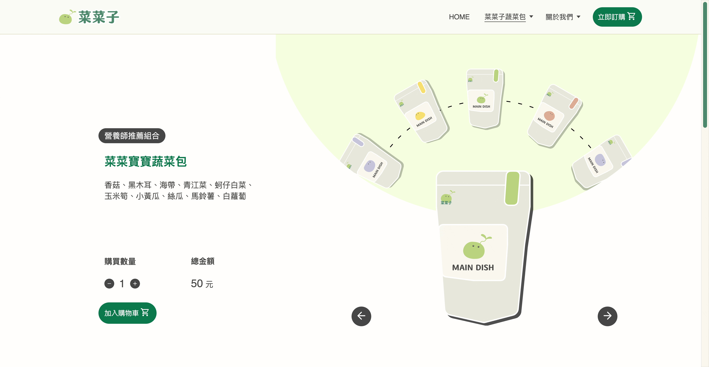
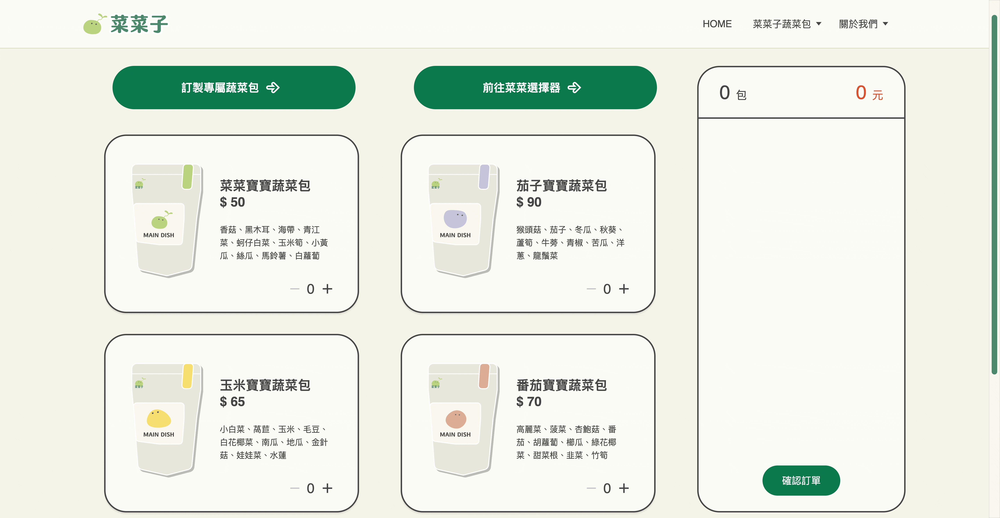

# 菜菜子｜讓您輕鬆享受健康飲食
Try to solve the problem of insufficient daily vegetable intake and make healthy eating easier.

 #### website : [https://arale025.github.io/eat-vegetables-together/](https://arale025.github.io/eat-vegetables-together/)

## Table of Contents
* [Features](#Features)
* [Sitemap](#Sitemap)
* [Technologies](#Technologies)

## Features
#### Product carousel

#### Shopping cart

#### Vegetable selector

## Sitemap

## Technologies
#### Front-End
* HTML
* CSS
* Javascript
* JQuery

#### UI/UX
* Figma
* Adobe Illustrator

#### Others
* Version Control: Git & GitHub
* Scrum: Trello

